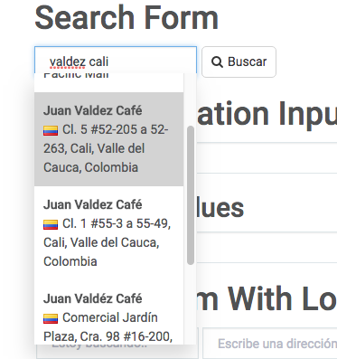

# Changelog

## v1.1.11 - 30 mar 2018
* SearchForm: Using InputGroup

## v1.1.8 - 9 mar 2018
* Added prop `searchInputProps` on SearchForm and SearchFormWithLocation that passes the props directly to the component

## v1.1.7 - 8 mar 2018
* Added support for Store results
* Updated private api to v1.3.9

